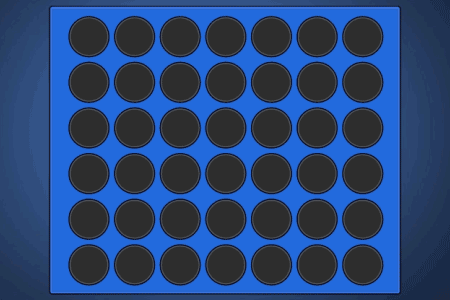

# Game Rules

The field (board) has seven columns and six rows. Two players play by alternately dropping a chip down one of the columns. The chip drops to the lowest unoccupied spot in that column. The first player to get four of his own chips in a row, either vertical, horizontal, or diagonal, wins. The game ends in a draw if the whole field is filled before someone wins.

### Attempt 1:
Baseline. Template offered by platform. Process settings info and offer a random move.

 
### Attempt 2:
Baseline. Clean all uncessary code. Random move.
 
### Update:
The current solver.cpp takes around 1 minute to fully evaluate a middle game position. but it solves quickly the end game position.
 
### Perfect Solution
http://blog.gamesolver.org/solving-connect-four/01-introduction/

 ## Other Ideas
 
 ### Q-Learning
 Do q learning offline and upload the final result (q-table)
 
 ### Some Simple Rules
 1. If opponent is close to 4 stop him
 2. Invest in one column
 3. When the investment in (2) is stopped by opponent, change column
 4. When you have 3, add a 4

### CNN
Some matrix with certain weights to infer move to play.

### MCST
Tree search to calculate move

### MCST + CNN
Value network to reduce amount of search

### Mixed 
Table when the match is starting, MCST when the number of options are reduced.
